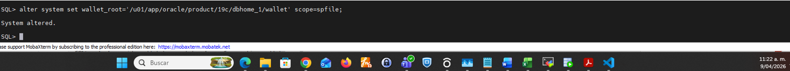
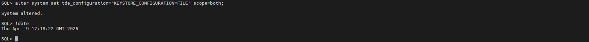
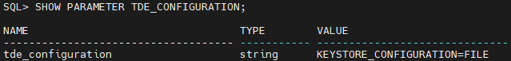
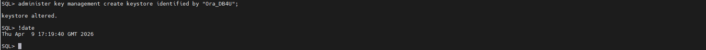
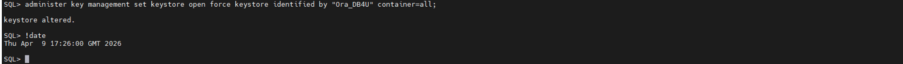
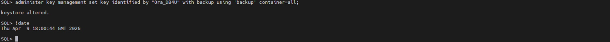
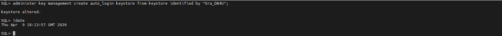
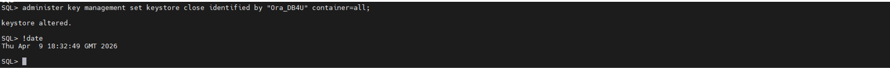
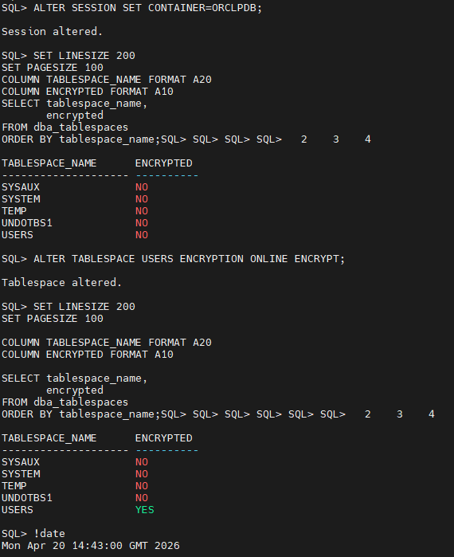
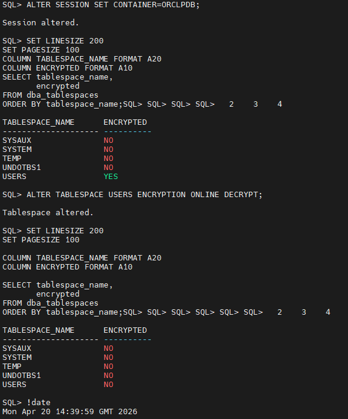

# 🔐 Enable TDE in Multitenant (Oracle 19c) – CDB/PDB Enterprise Runbook

## 📌 Overview

This runbook describes how to implement **Transparent Data Encryption (TDE)** in an Oracle Database 19c **Multitenant environment (CDB/PDB)** using a unified keystore.

It includes:

* Wallet configuration
* Keystore creation and management
* Master key creation (CDB and PDB)
* Multitenant validation
* Tablespace encryption (online)
* Key lifecycle and validation

This procedure reflects **real-world DBA execution in enterprise environments**.

---

## ⚙️ Prerequisites

* Oracle Database 19c (Multitenant enabled)
* SYSDBA privileges
* OS access to the database server
* Wallet directory defined

---

## 🧭 Procedure

---

## 🔹 Step 1 – Connect to CDB

```bash
sqlplus / as sysdba
```

---

## 🔹 Step 2 – Verify PDB status

```sql
SHOW PDBS;
```

If PDBs are not open:

```sql
ALTER PLUGGABLE DATABASE ALL OPEN INSTANCES=ALL;
ALTER PLUGGABLE DATABASE ORCLPDB SAVE STATE;
```

---

## 🔹 Step 3 – Validate TDE parameters

```sql
SHOW PARAMETER WALLET_ROOT;
SHOW PARAMETER TDE_CONFIGURATION;
```

---

## 🔹 Step 4 – Configure wallet_root

```sql
ALTER SYSTEM SET wallet_root='/u01/app/oracle/product/19c/dbhome_1/wallet' SCOPE=SPFILE;
```

---

## 🔹 Step 5 – Restart database

```sql
shutdown immediate;
startup;

SHOW PARAMETER WALLET_ROOT;
```

---

## 🔹 Step 6 – Configure keystore type

```sql
ALTER SYSTEM SET tde_configuration='KEYSTORE_CONFIGURATION=FILE' SCOPE=BOTH;

SHOW PARAMETER TDE_CONFIGURATION;
```




---

## 🔹 Step 7 – Create keystore

```sql
ADMINISTER KEY MANAGEMENT CREATE KEYSTORE IDENTIFIED BY "Ora_DB4U";
```

---

## 🔹 Step 8 – Validate wallet (initial state)

```sql
SET LINESIZE 200
SET PAGESIZE 100

COLUMN CON_ID      FORMAT 999
COLUMN STATUS      FORMAT A20
COLUMN WALLET_TYPE FORMAT A20

SELECT con_id,
       wallet_type,
       status
FROM v$encryption_wallet
ORDER BY con_id;
```

Expected:

* `CLOSED`

---

## 🔹 Step 9 – Open keystore (CDB + PDB)

```sql
ADMINISTER KEY MANAGEMENT SET KEYSTORE OPEN FORCE KEYSTORE IDENTIFIED BY "Ora_DB4U" CONTAINER=ALL;
```

---

## 🔹 Step 10 – Validate wallet across containers

```sql
SET LINESIZE 200
SET PAGESIZE 100

COLUMN CON_ID        FORMAT 999        HEADING 'CID'
COLUMN NAME          FORMAT A15        HEADING 'PDB_NAME'
COLUMN WRL_TYPE      FORMAT A15        HEADING 'WRL_TYPE'
COLUMN WRL_PARAMETER FORMAT A60        HEADING 'WALLET_PATH'
COLUMN WALLET_TYPE   FORMAT A20        HEADING 'WALLET_TYPE'
COLUMN STATUS        FORMAT A20        HEADING 'STATUS'

SELECT a.con_id,
       NVL(b.name, 'CDB$ROOT') AS name,
       a.wrl_type,
       a.wrl_parameter,
       a.wallet_type,
       a.status
FROM v$encryption_wallet a
LEFT JOIN v$pdbs b
  ON a.con_id = b.con_id
ORDER BY a.con_id;
```

Expected:

* CON_ID 1 → CDB root
* CON_ID 2 → PDB$SEED
* CON_ID 3 → ORCLPDB
* Status: `OPEN_NO_MASTER_KEY`

---

## 🔹 Step 11 – Create master key (CDB + PDB$SEED)

```sql
ADMINISTER KEY MANAGEMENT SET KEY IDENTIFIED BY "Ora_DB4U"
WITH BACKUP USING 'BACKUP' CONTAINER=ALL;
```

---

## 🔹 Step 12 – Create master key at PDB level

```sql
ALTER SESSION SET CONTAINER=ORCLPDB;

ADMINISTER KEY MANAGEMENT SET KEY IDENTIFIED BY "Ora_DB4U"
WITH BACKUP USING 'BACKUP' CONTAINER=ALL;
```

---

## 🔹 Step 13 – Validate key distribution

```sql
SET LINESIZE 200
SET PAGESIZE 100

COLUMN CON_ID   FORMAT 999
COLUMN NAME     FORMAT A15
COLUMN OPEN_MODE FORMAT A12
COLUMN KEY_ID   FORMAT A40

SELECT p.con_id,
       p.name,
       p.open_mode,
       ek.key_id
FROM v$pdbs p
LEFT JOIN v$encryption_keys ek
ON p.con_id = ek.con_id
ORDER BY p.con_id;
```

---

## 🔹 Step 14 – Create auto-login keystore

```sql
ADMINISTER KEY MANAGEMENT CREATE AUTO_LOGIN KEYSTORE
FROM KEYSTORE IDENTIFIED BY "Ora_DB4U";
```

---

## 🔹 Step 15 – Close password-based keystore

```sql

ADMINISTER KEY MANAGEMENT SET KEYSTORE CLOSE IDENTIFIED BY "Ora_DB4U" CONTAINER=ALL;
```

---

## 🔹 Step 16 – Validate wallet mode

```sql
SET LINESIZE 200
SET PAGESIZE 100

COLUMN CON_ID      FORMAT 999
COLUMN WALLET_TYPE FORMAT A20
COLUMN STATUS      FORMAT A20

SELECT con_id,
       wallet_type,
       status
FROM v$encryption_wallet
ORDER BY con_id;
```

Expected:

* `AUTOLOGIN OPEN`

---

# 💾 Tablespace Encryption (Data at Rest)

## 🔹 Step 17 – Encrypt tablespace at CDB level

```sql

SET LINESIZE 200
SET PAGESIZE 100

COLUMN TABLESPACE_NAME FORMAT A20
COLUMN ENCRYPTED FORMAT A10

SELECT tablespace_name,
       encrypted
FROM dba_tablespaces
ORDER BY tablespace_name;
```
ALTER TABLESPACE USERS ENCRYPTION ONLINE ENCRYPT;
```

Validate:

```sql
SET LINESIZE 200
SET PAGESIZE 100

COLUMN TABLESPACE_NAME FORMAT A20
COLUMN ENCRYPTED FORMAT A10

SELECT tablespace_name,
       encrypted
FROM dba_tablespaces
ORDER BY tablespace_name;
```

---

## 🔹 Step 18 – Encrypt tablespace at PDB level

```sql
ALTER SESSION SET CONTAINER=ORCLPDB;

SET LINESIZE 200
SET PAGESIZE 100
COLUMN TABLESPACE_NAME FORMAT A20
COLUMN ENCRYPTED FORMAT A10
SELECT tablespace_name,
       encrypted
FROM dba_tablespaces
ORDER BY tablespace_name;

ALTER TABLESPACE USERS ENCRYPTION ONLINE ENCRYPT;

SET LINESIZE 200
SET PAGESIZE 100

COLUMN TABLESPACE_NAME FORMAT A20
COLUMN ENCRYPTED FORMAT A10

SELECT tablespace_name,
       encrypted
FROM dba_tablespaces
ORDER BY tablespace_name;
```

---

## 🔹 Step 19 – Optional validation

```sql
SET LINESIZE 200
SET PAGESIZE 100

COLUMN KEYSTORE_MODE FORMAT A20
SELECT KEYSTORE_MODE
FROM V$ENCRYPTION_WALLET;

SET LINESIZE 200
SET PAGESIZE 100
COLUMN MASTERKEYID FORMAT A40
SELECT MASTERKEYID
FROM v$database_key_info;
```

---

## 🔹 Step 20 – Optional decryption tablespace at PDB level

```sql
ALTER SESSION SET CONTAINER=ORCLPDB;

SET LINESIZE 200
SET PAGESIZE 100
COLUMN TABLESPACE_NAME FORMAT A20
COLUMN ENCRYPTED FORMAT A10
SELECT tablespace_name,
       encrypted
FROM dba_tablespaces
ORDER BY tablespace_name;

ALTER TABLESPACE USERS ENCRYPTION ONLINE DECRYPT;

SET LINESIZE 200
SET PAGESIZE 100

COLUMN TABLESPACE_NAME FORMAT A20
COLUMN ENCRYPTED FORMAT A10

SELECT tablespace_name,
       encrypted
FROM dba_tablespaces
ORDER BY tablespace_name;
```

---

# 🔐 Multitenant Architecture Notes

* CON_ID 1 → CDB root
* CON_ID 2 → PDB$SEED
* CON_ID >2 → user PDBs

TDE operates in:

* **Unified mode** → shared keystore
* **Isolated mode** → per-PDB keystore

This runbook uses **Unified Mode**.

---

# 🛡️ Advanced Security (Optional)

TDE master keys can be stored in:

* Software wallet
* Hardware Security Module (HSM)

Using HSM improves:

* Security
* Compliance
* Key protection

---

# ✅ Validation Summary

| Phase                | Expected Result    |
| -------------------- | ------------------ |
| Wallet created       | CLOSED             |
| Wallet opened        | OPEN_NO_MASTER_KEY |
| Key created          | OPEN               |
| Auto-login           | AUTOLOGIN OPEN     |
| Tablespace encrypted | ENCRYPTED=YES      |

---

# ⚠️ Notes

* Restart required after setting `wallet_root`
* Always validate PDB state before encryption
* Backup keystore files regularly
* Protect wallet directory at OS level

---

# 🧠 ACE Contribution

This runbook demonstrates:

* Multitenant TDE implementation
* Key lifecycle management
* Encryption across CDB/PDB
* Real-world Oracle security operations

All steps were executed in a **hands-on lab/OCI environment**.

---

# 👤 Author

**Jesus Bastidas**
Oracle DBA | OCI Certified | ACE Apprentice
